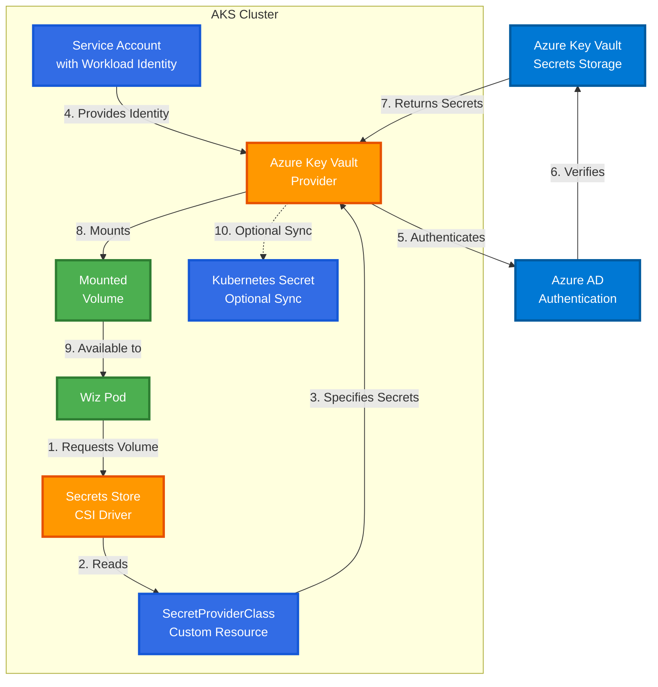

# Secret Provider Class with Azure Key Vault

Complete guide to using Azure Key Vault Provider for Secrets Store CSI Driver with Wiz Kubernetes Integration.

**Related Guides:** [README](README.md) | [Configuration](configuration-guide.md) | [Workflow](workflow-guide.md) | [Troubleshooting](troubleshooting-guide.md)

---

## Table of Contents

1. [What is Secret Provider Class?](#what-is-secret-provider-class)
2. [How It Works](#how-it-works)
3. [Architecture Diagram](#architecture-diagram)
4. [Benefits](#benefits)
5. [Prerequisites](#prerequisites)
6. [Implementation Steps](#implementation-steps)
7. [Wiz Integration Example](#wiz-integration-example)
8. [Troubleshooting](#troubleshooting)

---

## What is Secret Provider Class?

**Secret Provider Class (SPC)** is a Kubernetes custom resource that defines how to retrieve secrets from external secret stores like Azure Key Vault.

### Key Concepts

- **Secrets Store CSI Driver**: A Container Storage Interface (CSI) driver that allows Kubernetes to mount secrets from external stores as volumes
- **Azure Key Vault Provider**: A provider plugin that connects the CSI driver to Azure Key Vault
- **Secret Provider Class**: A custom resource (CR) that specifies which secrets to fetch and how to mount them

### Traditional vs Secret Provider Class

| Approach | Storage Location | Rotation | Security |
|----------|------------------|----------|----------|
| **Traditional Kubernetes Secrets** | Stored in etcd (base64 encoded) | Manual | ⚠️ Visible in Git if committed |
| **GitHub Secrets** | GitHub repository | Manual via workflow | ⚠️ Requires GitHub access |
| **Secret Provider Class** | Azure Key Vault | Automatic sync | ✅ Centralized, audit logs, RBAC |

---

## How It Works

### High-Level Flow

```
1. Pod requests secret mount
   ↓
2. CSI Driver intercepts request
   ↓
3. Reads SecretProviderClass definition
   ↓
4. Azure Key Vault Provider authenticates with managed identity
   ↓
5. Fetches secrets from Azure Key Vault
   ↓
6. Mounts secrets as files in pod volume
   ↓
7. (Optional) Syncs to Kubernetes Secret
```

### Authentication Methods

1. **Workload Identity (Recommended)** - Uses Azure AD Workload Identity for pods
2. **Managed Identity** - Uses AKS cluster's managed identity
3. **Service Principal** - Uses Azure AD application credentials

---

## Architecture Diagram

### Secrets Store CSI Driver Architecture



### Component Explanation

| Component | Description | Purpose |
|-----------|-------------|---------|
| **Azure Key Vault** | Cloud-based secret storage | Stores Wiz credentials, ACR passwords |
| **Azure AD** | Identity and access management | Authenticates pod requests |
| **CSI Driver** | Kubernetes volume driver | Intercepts secret mount requests |
| **Azure Key Vault Provider** | CSI driver plugin | Connects to Azure Key Vault |
| **SecretProviderClass** | Kubernetes custom resource | Defines which secrets to fetch |
| **Service Account** | Kubernetes identity | Maps to Azure AD identity |
| **Workload Identity** | Federated credential | Allows pod to authenticate to Azure |

---

## Benefits

### 1. **Enhanced Security**

✅ Secrets never stored in Git or etcd (plain or base64)
✅ Centralized access control with Azure RBAC
✅ Audit logs for all secret access
✅ Automatic secret rotation without pod restart

### 2. **Simplified Management**

✅ Single source of truth (Key Vault)
✅ No manual secret creation in Kubernetes
✅ Consistent across all environments
✅ Reduces GitHub Secrets sprawl

### 3. **Compliance & Governance**

✅ Meets enterprise security requirements
✅ Separation of duties (KeyVault admin vs K8s admin)
✅ Integration with Azure Policy
✅ Encryption at rest and in transit

### 4. **Developer Experience**

✅ No need to manage secrets in multiple places
✅ Automatic synchronization
✅ Works with existing pod definitions (minimal changes)

---

## Prerequisites

### 1. Enable CSI Driver on AKS

The Secrets Store CSI Driver is **enabled by default** on AKS clusters version 1.21+.

To verify or enable:

```bash
# Check if addon is enabled
az aks show --resource-group <rg> --name <cluster> \
  --query "addonProfiles.azureKeyvaultSecretsProvider.enabled"

# Enable if not already enabled
az aks enable-addons \
  --resource-group <rg> \
  --name <cluster> \
  --addons azure-keyvault-secrets-provider
```

### 2. Enable Workload Identity (Recommended)

```bash
# Enable OIDC issuer (required for Workload Identity)
az aks update \
  --resource-group <rg> \
  --name <cluster> \
  --enable-oidc-issuer \
  --enable-workload-identity
```

### 3. Azure Key Vault Setup

```bash
# Create Key Vault (if not exists)
az keyvault create \
  --name <keyvault-name> \
  --resource-group <rg> \
  --location <location>

# Store secrets
az keyvault secret set \
  --vault-name <keyvault-name> \
  --name wiz-client-id \
  --value "<your-wiz-client-id>"

az keyvault secret set \
  --vault-name <keyvault-name> \
  --name wiz-client-token \
  --value "<your-wiz-client-token>"

az keyvault secret set \
  --vault-name <keyvault-name> \
  --name acr-username \
  --value "<your-acr-username>"

az keyvault secret set \
  --vault-name <keyvault-name> \
  --name acr-password \
  --value "<your-acr-password>"
```

---

## Implementation Steps

### Step 1: Create Azure Managed Identity

```bash
# Get AKS OIDC Issuer URL
export AKS_OIDC_ISSUER=$(az aks show \
  --resource-group <rg> \
  --name <cluster> \
  --query "oidcIssuerProfile.issuerUrl" -o tsv)

# Create User Assigned Managed Identity
az identity create \
  --name wiz-workload-identity \
  --resource-group <rg>

# Get identity client ID
export USER_ASSIGNED_CLIENT_ID=$(az identity show \
  --name wiz-workload-identity \
  --resource-group <rg> \
  --query 'clientId' -o tsv)

# Get identity principal ID
export IDENTITY_PRINCIPAL_ID=$(az identity show \
  --name wiz-workload-identity \
  --resource-group <rg> \
  --query 'principalId' -o tsv)
```

### Step 2: Grant Key Vault Access

```bash
# Grant "Key Vault Secrets User" role to managed identity
az keyvault set-policy \
  --name <keyvault-name> \
  --object-id $IDENTITY_PRINCIPAL_ID \
  --secret-permissions get list
```

### Step 3: Create Federated Credential

```bash
# Create federated identity credential
az identity federated-credential create \
  --name wiz-federated-credential \
  --identity-name wiz-workload-identity \
  --resource-group <rg> \
  --issuer $AKS_OIDC_ISSUER \
  --subject system:serviceaccount:wiz:wiz-service-account
```

### Step 4: Create Kubernetes Service Account

**File:** `wiz-service-account.yaml`

```yaml
apiVersion: v1
kind: ServiceAccount
metadata:
  name: wiz-service-account
  namespace: wiz
  annotations:
    azure.workload.identity/client-id: "<USER_ASSIGNED_CLIENT_ID>"
  labels:
    azure.workload.identity/use: "true"
```

Apply:
```bash
kubectl apply -f wiz-service-account.yaml
```

### Step 5: Create SecretProviderClass

**File:** `wiz-secretproviderclass.yaml`

```yaml
apiVersion: secrets-store.csi.x-k8s.io/v1
kind: SecretProviderClass
metadata:
  name: wiz-secrets
  namespace: wiz
spec:
  provider: azure
  parameters:
    usePodIdentity: "false"
    useVMManagedIdentity: "false"
    clientID: "<USER_ASSIGNED_CLIENT_ID>"  # Workload Identity client ID
    keyvaultName: "<keyvault-name>"
    tenantId: "<tenant-id>"
    objects: |
      array:
        - |
          objectName: wiz-client-id
          objectType: secret
          objectAlias: clientId
        - |
          objectName: wiz-client-token
          objectType: secret
          objectAlias: clientToken
        - |
          objectName: acr-username
          objectType: secret
          objectAlias: acrUsername
        - |
          objectName: acr-password
          objectType: secret
          objectAlias: acrPassword
  # Optional: Sync to Kubernetes Secret
  secretObjects:
    - secretName: wiz-api-token
      type: Opaque
      data:
        - objectName: clientId
          key: clientId
        - objectName: clientToken
          key: clientToken
    - secretName: acr-secret
      type: kubernetes.io/dockerconfigjson
      data:
        - objectName: acrUsername
          key: username
        - objectName: acrPassword
          key: password
```

Apply:
```bash
kubectl apply -f wiz-secretproviderclass.yaml
```

### Step 6: Update Pod to Use Secret Provider Class

**Option A: Mount as Volume (Recommended)**

```yaml
apiVersion: v1
kind: Pod
metadata:
  name: wiz-connector
  namespace: wiz
  labels:
    azure.workload.identity/use: "true"
spec:
  serviceAccountName: wiz-service-account
  containers:
    - name: connector
      image: wiziopublic.azurecr.io/wiz-app/wiz-connector:latest
      volumeMounts:
        - name: secrets-store
          mountPath: "/mnt/secrets-store"
          readOnly: true
      env:
        - name: WIZ_CLIENT_ID
          valueFrom:
            secretKeyRef:
              name: wiz-api-token
              key: clientId
        - name: WIZ_CLIENT_TOKEN
          valueFrom:
            secretKeyRef:
              name: wiz-api-token
              key: clientToken
  volumes:
    - name: secrets-store
      csi:
        driver: secrets-store.csi.k8s.io
        readOnly: true
        volumeAttributes:
          secretProviderClass: "wiz-secrets"
```

**Option B: Sync to Kubernetes Secret (Use with existing pods)**

If using `secretObjects` in SecretProviderClass (Step 5), secrets are automatically synced to Kubernetes Secrets. Existing pods can reference them normally:

```yaml
env:
  - name: WIZ_CLIENT_ID
    valueFrom:
      secretKeyRef:
        name: wiz-api-token
        key: clientId
  - name: WIZ_CLIENT_TOKEN
    valueFrom:
      secretKeyRef:
        name: wiz-api-token
        key: clientToken
```

---

## Wiz Integration Example

### Complete Implementation for Wiz Deployment

#### 1. Directory Structure

```
wiz-deployment/
├── namespace.yaml
├── service-account.yaml
├── secret-provider-class.yaml
└── helm-values.yaml
```

#### 2. Namespace (namespace.yaml)

```yaml
apiVersion: v1
kind: Namespace
metadata:
  name: wiz
```

#### 3. Service Account (service-account.yaml)

```yaml
apiVersion: v1
kind: ServiceAccount
metadata:
  name: wiz-service-account
  namespace: wiz
  annotations:
    azure.workload.identity/client-id: "${USER_ASSIGNED_CLIENT_ID}"
  labels:
    azure.workload.identity/use: "true"
```

#### 4. Secret Provider Class (secret-provider-class.yaml)

```yaml
apiVersion: secrets-store.csi.x-k8s.io/v1
kind: SecretProviderClass
metadata:
  name: wiz-secrets
  namespace: wiz
spec:
  provider: azure
  parameters:
    usePodIdentity: "false"
    useVMManagedIdentity: "false"
    clientID: "${USER_ASSIGNED_CLIENT_ID}"
    keyvaultName: "${KEYVAULT_NAME}"
    tenantId: "${TENANT_ID}"
    objects: |
      array:
        - |
          objectName: wiz-client-id
          objectType: secret
          objectAlias: clientId
        - |
          objectName: wiz-client-token
          objectType: secret
          objectAlias: clientToken
  secretObjects:
    - secretName: wiz-api-token
      type: Opaque
      data:
        - objectName: clientId
          key: clientId
        - objectName: clientToken
          key: clientToken
```

#### 5. Helm Values Override (helm-values.yaml)

```yaml
# Override for wiz-kubernetes-integration Helm chart
global:
  wizApiToken:
    secret:
      name: wiz-api-token
      clientIdKey: clientId
      clientTokenKey: clientToken

wiz-kubernetes-connector:
  enabled: true
  serviceAccount:
    create: false  # Use existing service account
    name: wiz-service-account
  podLabels:
    azure.workload.identity/use: "true"
  volumes:
    - name: secrets-store
      csi:
        driver: secrets-store.csi.k8s.io
        readOnly: true
        volumeAttributes:
          secretProviderClass: "wiz-secrets"
  volumeMounts:
    - name: secrets-store
      mountPath: "/mnt/secrets-store"
      readOnly: true

wiz-sensor:
  enabled: true
  serviceAccount:
    create: false
    name: wiz-service-account
  podLabels:
    azure.workload.identity/use: "true"
  volumes:
    - name: secrets-store
      csi:
        driver: secrets-store.csi.k8s.io
        readOnly: true
        volumeAttributes:
          secretProviderClass: "wiz-secrets"
  volumeMounts:
    - name: secrets-store
      mountPath: "/mnt/secrets-store"
      readOnly: true

wiz-admission-controller:
  enabled: true
  serviceAccount:
    create: false
    name: wiz-service-account
  podLabels:
    azure.workload.identity/use: "true"
  volumes:
    - name: secrets-store
      csi:
        driver: secrets-store.csi.k8s.io
        readOnly: true
        volumeAttributes:
          secretProviderClass: "wiz-secrets"
  volumeMounts:
    - name: secrets-store
      mountPath: "/mnt/secrets-store"
      readOnly: true
```

#### 6. Deployment Script

```bash
#!/bin/bash
set -e

# Variables
RESOURCE_GROUP="my-aks-rg"
CLUSTER_NAME="my-aks-cluster"
KEYVAULT_NAME="my-wiz-kv"
NAMESPACE="wiz"

# Get OIDC Issuer
AKS_OIDC_ISSUER=$(az aks show \
  --resource-group $RESOURCE_GROUP \
  --name $CLUSTER_NAME \
  --query "oidcIssuerProfile.issuerUrl" -o tsv)

# Create Managed Identity
az identity create \
  --name wiz-workload-identity \
  --resource-group $RESOURCE_GROUP

USER_ASSIGNED_CLIENT_ID=$(az identity show \
  --name wiz-workload-identity \
  --resource-group $RESOURCE_GROUP \
  --query 'clientId' -o tsv)

IDENTITY_PRINCIPAL_ID=$(az identity show \
  --name wiz-workload-identity \
  --resource-group $RESOURCE_GROUP \
  --query 'principalId' -o tsv)

TENANT_ID=$(az account show --query tenantId -o tsv)

# Grant Key Vault access
az keyvault set-policy \
  --name $KEYVAULT_NAME \
  --object-id $IDENTITY_PRINCIPAL_ID \
  --secret-permissions get list

# Create federated credential
az identity federated-credential create \
  --name wiz-federated-credential \
  --identity-name wiz-workload-identity \
  --resource-group $RESOURCE_GROUP \
  --issuer $AKS_OIDC_ISSUER \
  --subject system:serviceaccount:$NAMESPACE:wiz-service-account

# Apply Kubernetes resources
export USER_ASSIGNED_CLIENT_ID
export KEYVAULT_NAME
export TENANT_ID

envsubst < service-account.yaml | kubectl apply -f -
envsubst < secret-provider-class.yaml | kubectl apply -f -

# Deploy Wiz with Helm
helm upgrade --install wiz-kubernetes-integration \
  wiz-sec/wiz-kubernetes-integration \
  --namespace $NAMESPACE \
  --values helm-values.yaml

echo "✅ Wiz deployment with Secret Provider Class complete!"
```

---

## Troubleshooting

### Issue 1: Pod Cannot Mount Secrets

**Symptoms:**
```
MountVolume.SetUp failed for volume "secrets-store" :
rpc error: code = Unknown desc = failed to mount secrets store objects
```

**Solutions:**

1. **Check CSI Driver pods:**
```bash
kubectl get pods -n kube-system -l app=secrets-store-csi-driver
kubectl get pods -n kube-system -l app=csi-secrets-store-provider-azure
```

2. **Check pod identity label:**
```bash
kubectl get pod <pod-name> -n wiz -o jsonpath='{.metadata.labels.azure\.workload\.identity/use}'
# Should return: true
```

3. **Verify service account annotation:**
```bash
kubectl get sa wiz-service-account -n wiz -o jsonpath='{.metadata.annotations.azure\.workload\.identity/client-id}'
# Should return: your-client-id
```

### Issue 2: Authentication Failed

**Error:**
```
failed to get key vault token: nmi response failed with status code: 403
```

**Solutions:**

1. **Verify federated credential:**
```bash
az identity federated-credential list \
  --identity-name wiz-workload-identity \
  --resource-group <rg>
```

2. **Check subject matches:**
   - Should be: `system:serviceaccount:wiz:wiz-service-account`

3. **Verify Key Vault permissions:**
```bash
az keyvault show --name <keyvault-name> \
  --query "properties.accessPolicies[?objectId=='<identity-principal-id>'].permissions"
```

### Issue 3: Secret Not Found in Key Vault

**Error:**
```
failed to get secret objectName:wiz-client-id, error: keyvault.BaseClient#GetSecret:
Failure responding to request: StatusCode=404
```

**Solutions:**

1. **List secrets in Key Vault:**
```bash
az keyvault secret list --vault-name <keyvault-name> -o table
```

2. **Verify secret name matches:**
   - SecretProviderClass `objectName` must match Key Vault secret name exactly (case-sensitive)

3. **Check secret exists:**
```bash
az keyvault secret show --vault-name <keyvault-name> --name wiz-client-id
```

### Issue 4: Secrets Not Syncing to Kubernetes Secret

**Symptoms:** Volume mounted but Kubernetes Secret not created

**Solutions:**

1. **Check SecretProviderClass has `secretObjects`:**
```bash
kubectl get secretproviderclass wiz-secrets -n wiz -o yaml | grep -A 10 secretObjects
```

2. **Verify pod has mounted the volume:**
```bash
kubectl describe pod <pod-name> -n wiz | grep "secrets-store"
```

3. **Check CSI driver logs:**
```bash
kubectl logs -n kube-system -l app=secrets-store-csi-driver --tail=50
```

### Debug Commands

```bash
# Check SecretProviderClass
kubectl get secretproviderclass -n wiz
kubectl describe secretproviderclass wiz-secrets -n wiz

# Check CSI Driver status
kubectl get csidrivers
kubectl describe csidriver secrets-store.csi.k8s.io

# Check provider pods
kubectl get pods -n kube-system -l app=csi-secrets-store-provider-azure

# View pod events
kubectl get events -n wiz --sort-by='.lastTimestamp'

# Test secret mount in debug pod
kubectl run -it --rm debug \
  --image=busybox \
  --restart=Never \
  --serviceaccount=wiz-service-account \
  --namespace=wiz \
  --labels="azure.workload.identity/use=true" \
  --overrides='{"spec":{"volumes":[{"name":"secrets","csi":{"driver":"secrets-store.csi.k8s.io","readOnly":true,"volumeAttributes":{"secretProviderClass":"wiz-secrets"}}}],"containers":[{"name":"debug","image":"busybox","command":["sh","-c","ls -la /mnt/secrets && cat /mnt/secrets/*"],"volumeMounts":[{"name":"secrets","mountPath":"/mnt/secrets"}]}]}}'
```

---

## Comparison: GitHub Secrets vs Secret Provider Class

### Current Approach (GitHub Secrets)

**Workflow:** GitHub Actions → Create K8s Secrets → Pods reference secrets

**Pros:**
- ✅ Simple to understand
- ✅ Works without Azure dependencies
- ✅ Integrated with existing CI/CD

**Cons:**
- ❌ Secrets stored in GitHub (not enterprise-grade)
- ❌ Manual rotation requires workflow re-run
- ❌ No centralized secret management
- ❌ Limited audit capabilities
- ❌ Secrets visible to anyone with repo access

### Secret Provider Class Approach

**Workflow:** Key Vault → CSI Driver → Pods mount secrets

**Pros:**
- ✅ Enterprise-grade secret management
- ✅ Automatic secret rotation
- ✅ Centralized in Azure Key Vault
- ✅ Full audit logs
- ✅ Azure RBAC integration
- ✅ Separation of duties
- ✅ Never stored in Git or etcd

**Cons:**
- ❌ More complex initial setup
- ❌ Azure-specific (not portable)
- ❌ Requires AKS 1.21+

---

## Migration Path

To migrate from GitHub Secrets to Secret Provider Class:

1. **Phase 1: Setup Infrastructure**
   - Enable CSI Driver on AKS
   - Create Key Vault and store secrets
   - Create managed identity and federated credentials

2. **Phase 2: Deploy SPC Resources**
   - Deploy SecretProviderClass
   - Deploy Service Account with Workload Identity
   - Test with a single pod

3. **Phase 3: Update Helm Charts**
   - Modify Wiz Helm values to use new service account
   - Add volume mounts for CSI driver
   - Deploy to dev/test environment first

4. **Phase 4: Update GitHub Workflow (Optional)**
   - Workflow can skip secret creation steps
   - Focus only on Flux configuration
   - Remove GitHub Secrets (except AZURE_CREDENTIALS)

5. **Phase 5: Production Rollout**
   - Deploy to production clusters
   - Monitor and validate
   - Remove old Kubernetes Secrets

---

## Related Guides

- **[Configuration Guide](configuration-guide.md)** - Current secret management approach
- **[Workflow Guide](workflow-guide.md)** - GitHub Actions automation
- **[Troubleshooting Guide](troubleshooting-guide.md)** - Debug common issues
- **[README](README.md)** - Back to overview

---

**Document Version:** 1.0
**Last Updated:** 2026-01-08
**Maintainer:** DevOps Team
