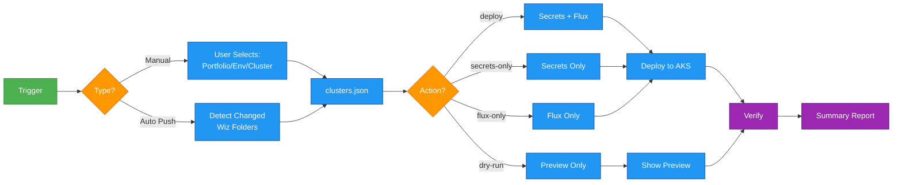
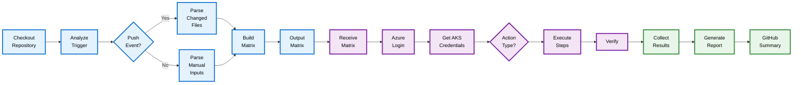
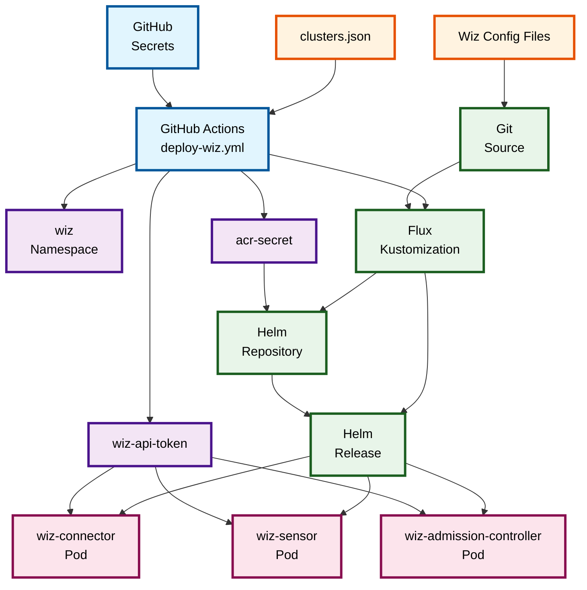

# GitHub Actions Workflow Guide

Complete guide to the Wiz deployment GitHub Actions workflow, including flowcharts and execution details.

**Related Guides:** [README](README.md) | [Configuration](configuration-guide.md) | [Troubleshooting](troubleshooting-guide.md)

---

## Table of Contents

1. [Workflow Flowcharts](#workflow-flowcharts)
2. [GitHub Actions Workflow](#github-actions-workflow)
3. [Workflow Jobs Explained](#workflow-jobs-explained)
4. [Action Types](#action-types)
5. [Usage Examples](#usage-examples)

---

## Workflow Flowcharts

### Complete Deployment Flow

```mermaid
flowchart TD
    Start([Deployment Triggered]) --> TriggerCheck{Trigger Type?}

    %% Manual Trigger Path
    TriggerCheck -->|Manual Dispatch| ManualInputs[Collect User Inputs:<br/>- Portfolio<br/>- Environment<br/>- Cluster<br/>- Action]
    ManualInputs --> FilterClusters[Filter clusters.json<br/>based on inputs]

    %% Auto Trigger Path
    TriggerCheck -->|Git Push to **/Wiz/**| DetectChanges[Analyze Changed Files<br/>in Wiz folders]
    DetectChanges --> ExtractPath[Extract Portfolio,<br/>Environment, Cluster<br/>from file paths]
    ExtractPath --> MatchConfig[Match with<br/>clusters.json]

    %% Merge Paths
    FilterClusters --> BuildMatrix[Build Deployment Matrix]
    MatchConfig --> BuildMatrix

    BuildMatrix --> MatrixCheck{Matrix Empty?}
    MatrixCheck -->|Yes| NoTargets[No deployment targets<br/>Workflow ends]
    MatrixCheck -->|No| DisplayTargets[Display Deployment Targets]

    DisplayTargets --> ParallelDeploy{For Each Cluster<br/>in Matrix}

    %% Parallel Deployment Loop
    ParallelDeploy --> ClusterInfo[Display Cluster Info:<br/>- Portfolio<br/>- Environment<br/>- Resource Group]

    ClusterInfo --> AzureLogin[Azure Login with<br/>Service Principal]
    AzureLogin --> SetSubscription[Set Azure Subscription]
    SetSubscription --> GetAKSCreds[Get AKS Credentials<br/>kubectl config]

    GetAKSCreds --> ActionCheck{Action Type?}

    %% Dry Run Path
    ActionCheck -->|dry-run| DryRunPreview[Preview Actions:<br/>- Namespace creation<br/>- Secret creation<br/>- Flux setup]
    DryRunPreview --> ShowCurrentState[Show Current State:<br/>- Namespaces<br/>- Flux configs]
    ShowCurrentState --> VerifyDeploy

    %% Secrets Only Path
    ActionCheck -->|secrets-only| CreateNamespace[Create wiz Namespace]
    CreateNamespace --> CreateACRSecret[Create ACR Secret<br/>docker-registry type]
    CreateACRSecret --> ValidateWizCreds{Wiz Credentials<br/>Found?}
    ValidateWizCreds -->|No| ErrorMissingCreds[Error: Missing Wiz<br/>credentials for prefix]
    ValidateWizCreds -->|Yes| CreateWizSecret[Create wiz-api-token<br/>Secret with clientId<br/>and clientToken]
    CreateWizSecret --> VerifyDeploy

    %% Flux Only Path
    ActionCheck -->|flux-only| CheckFluxExists{Flux Config<br/>Exists?}
    CheckFluxExists -->|Yes| UpdateFlux[Update Existing<br/>Flux Configuration]
    CheckFluxExists -->|No| CreateFlux[Create New Flux<br/>Configuration:<br/>- Source: GitHub repo<br/>- Path: Portfolio/Env/Cluster/Wiz]
    UpdateFlux --> VerifyDeploy
    CreateFlux --> VerifyDeploy

    %% Full Deploy Path
    ActionCheck -->|deploy| FullDeployNS[Create wiz Namespace]
    FullDeployNS --> FullDeployACR[Create ACR Secret]
    FullDeployACR --> ValidateFullWizCreds{Wiz Credentials<br/>Found?}
    ValidateFullWizCreds -->|No| ErrorMissingFullCreds[Error: Missing Wiz<br/>credentials]
    ValidateFullWizCreds -->|Yes| FullDeployWizSecret[Create wiz-api-token<br/>Secret]
    FullDeployWizSecret --> CheckFluxExistsFull{Flux Config<br/>Exists?}
    CheckFluxExistsFull -->|Yes| UpdateFluxFull[Update Flux<br/>Configuration]
    CheckFluxExistsFull -->|No| CreateFluxFull[Create Flux<br/>Configuration]
    UpdateFluxFull --> VerifyDeploy
    CreateFluxFull --> VerifyDeploy

    %% Verification
    VerifyDeploy[Verify Deployment:<br/>- List secrets in wiz namespace<br/>- List Flux configurations<br/>- List Kustomizations]

    VerifyDeploy --> DeployComplete{More Clusters<br/>in Matrix?}
    DeployComplete -->|Yes| ParallelDeploy
    DeployComplete -->|No| GenerateSummary

    %% Summary
    GenerateSummary[Generate Summary Report:<br/>- Trigger info<br/>- Input parameters<br/>- Job results]

    GenerateSummary --> End([Deployment Complete])

    ErrorMissingCreds --> End
    ErrorMissingFullCreds --> End
    NoTargets --> End

    %% Styling
    classDef startEnd fill:#4CAF50,stroke:#2E7D32,color:#fff,stroke-width:3px
    classDef decision fill:#FF9800,stroke:#E65100,color:#fff,stroke-width:2px
    classDef process fill:#2196F3,stroke:#0D47A1,color:#fff,stroke-width:2px
    classDef error fill:#F44336,stroke:#B71C1C,color:#fff,stroke-width:2px
    classDef verify fill:#9C27B0,stroke:#4A148C,color:#fff,stroke-width:2px

    class Start,End startEnd
    class TriggerCheck,MatrixCheck,ActionCheck,ValidateWizCreds,ValidateFullWizCreds,CheckFluxExists,CheckFluxExistsFull,DeployComplete decision
    class ManualInputs,FilterClusters,DetectChanges,ExtractPath,MatchConfig,BuildMatrix,AzureLogin,SetSubscription,GetAKSCreds,CreateNamespace,CreateACRSecret,CreateWizSecret,UpdateFlux,CreateFlux,FullDeployNS,FullDeployACR,FullDeployWizSecret,UpdateFluxFull,CreateFluxFull process
    class ErrorMissingCreds,ErrorMissingFullCreds error
    class VerifyDeploy,GenerateSummary verify
```



### Simplified Decision Flow



### GitHub Actions Job Flow



**Flow Explanation:**
- 🔵 **Blue boxes** = Job 1 (Prepare) - Builds deployment matrix
- 🟣 **Purple boxes** = Job 2 (Deploy) - Executes deployment in parallel
- 🟢 **Green boxes** = Job 3 (Summary) - Generates report

### Flux Integration Architecture



**Component Legend:**
- 🟡 **Orange** = GitHub Repository (config & Wiz files)
- 🔵 **Blue** = GitHub Actions (workflow & secrets)
- 🟣 **Purple** = Kubernetes Secrets (ACR & Wiz tokens)
- 🟢 **Green** = Flux Components (GitOps resources)
- 🔴 **Pink** = Wiz Pods (deployed components)

---

## GitHub Actions Workflow

**File:** `.github/workflows/deploy-wiz.yml`

```yaml
name: Deploy Wiz Integration

on:
  # Manual trigger with dropdown selections
  workflow_dispatch:
    inputs:
      portfolio:
        description: 'Portfolio Name'
        required: true
        type: choice
        options:
          - 'Selling Data'
          - 'Another Portfolio'
          - 'ALL'
      environment:
        description: 'Environment'
        required: true
        type: choice
        options:
          - 'Non Production'
          - 'Production'
          - 'ALL'
      cluster:
        description: 'Cluster (leave empty for all in selected portfolio/env)'
        required: false
        type: string
      action:
        description: 'Action to perform'
        required: true
        type: choice
        options:
          - 'deploy'
          - 'secrets-only'
          - 'flux-only'
          - 'dry-run'

  # Auto-trigger on Wiz folder changes
  push:
    branches: [main]
    paths:
      - '**/Wiz/**'

env:
  WIZ_NAMESPACE: wiz

jobs:
  # ============================================================
  # Job 1: Determine which clusters to deploy
  # ============================================================
  prepare:
    runs-on: ubuntu-latest
    outputs:
      matrix: ${{ steps.set-matrix.outputs.matrix }}
    steps:
      - name: Checkout Repository
        uses: actions/checkout@v4
        with:
          fetch-depth: 2  # Need previous commit for diff

      - name: Set Deployment Matrix
        id: set-matrix
        run: |
          if [[ "${{ github.event_name }}" == "push" ]]; then
            echo "=== Push event detected, analyzing changed files ==="

            # Get changed files in Wiz folders
            CHANGED_FILES=$(git diff --name-only HEAD~1 HEAD | grep "/Wiz/" || true)

            if [ -z "$CHANGED_FILES" ]; then
              echo "No Wiz changes detected"
              echo "matrix={\"include\":[]}" >> $GITHUB_OUTPUT
              exit 0
            fi

            echo "Changed files:"
            echo "$CHANGED_FILES"

            # Build matrix from changed paths
            MATRIX_ITEMS="[]"
            while IFS= read -r file; do
              if [ -n "$file" ]; then
                # Extract portfolio, environment, cluster from path
                PORTFOLIO=$(echo "$file" | cut -d'/' -f1)
                ENVIRONMENT=$(echo "$file" | cut -d'/' -f2)
                CLUSTER=$(echo "$file" | cut -d'/' -f3)

                # Find matching cluster config
                CLUSTER_CONFIG=$(jq -c --arg p "$PORTFOLIO" --arg e "$ENVIRONMENT" --arg c "$CLUSTER" \
                  '.clusters[] | select(.portfolio == $p and .environment == $e and .cluster_name == $c)' \
                  config/clusters.json)

                if [ -n "$CLUSTER_CONFIG" ]; then
                  # Add to matrix if not already present
                  MATRIX_ITEMS=$(echo "$MATRIX_ITEMS" | jq -c --argjson item "$CLUSTER_CONFIG" \
                    'if any(. == $item) then . else . + [$item] end')
                fi
              fi
            done <<< "$CHANGED_FILES"

            echo "matrix={\"include\":$MATRIX_ITEMS}" >> $GITHUB_OUTPUT

          else
            echo "=== Manual trigger, filtering based on inputs ==="

            PORTFOLIO="${{ github.event.inputs.portfolio }}"
            ENVIRONMENT="${{ github.event.inputs.environment }}"
            CLUSTER="${{ github.event.inputs.cluster }}"

            echo "Portfolio: $PORTFOLIO"
            echo "Environment: $ENVIRONMENT"
            echo "Cluster: $CLUSTER"

            MATRIX_JSON=$(jq -c --arg p "$PORTFOLIO" --arg e "$ENVIRONMENT" --arg c "$CLUSTER" '
              .clusters | map(select(
                ($p == "ALL" or .portfolio == $p) and
                ($e == "ALL" or .environment == $e) and
                ($c == "" or .cluster_name == $c)
              ))
            ' config/clusters.json)

            echo "matrix={\"include\":$MATRIX_JSON}" >> $GITHUB_OUTPUT
          fi

      - name: Display Deployment Targets
        run: |
          echo "=== Deployment Targets ==="
          echo '${{ steps.set-matrix.outputs.matrix }}' | jq .

  # ============================================================
  # Job 2: Deploy to each cluster (parallel execution)
  # ============================================================
  deploy:
    needs: prepare
    if: ${{ needs.prepare.outputs.matrix != '{"include":[]}' && needs.prepare.outputs.matrix != '' }}
    runs-on: ubuntu-latest
    strategy:
      matrix: ${{ fromJson(needs.prepare.outputs.matrix) }}
      fail-fast: false
      max-parallel: 3

    steps:
      - name: Checkout Repository
        uses: actions/checkout@v4

      - name: Display Deployment Info
        run: |
          echo "============================================"
          echo "📦 Portfolio:      ${{ matrix.portfolio }}"
          echo "🌍 Environment:    ${{ matrix.environment }}"
          echo "☸️  Cluster:        ${{ matrix.cluster_name }}"
          echo "📁 Resource Group: ${{ matrix.resource_group }}"
          echo "🔑 Secret Prefix:  ${{ matrix.wiz_secret_prefix }}"
          echo "============================================"

      - name: Azure Login
        uses: azure/login@v2
        with:
          creds: ${{ secrets.AZURE_CREDENTIALS }}

      - name: Set Azure Subscription
        run: |
          az account set --subscription ${{ matrix.subscription_id }}
          echo "Active subscription: $(az account show --query name -o tsv)"

      - name: Get AKS Credentials
        run: |
          az aks get-credentials \
            --resource-group ${{ matrix.resource_group }} \
            --name ${{ matrix.cluster_name }} \
            --overwrite-existing

          echo "Connected to cluster:"
          kubectl cluster-info | head -2

      # --------------------------------------------------------
      # Dry Run Mode
      # --------------------------------------------------------
      - name: Dry Run - Preview Changes
        if: ${{ github.event.inputs.action == 'dry-run' }}
        run: |
          echo "============================================"
          echo "           🔍 DRY RUN MODE                  "
          echo "============================================"
          echo ""
          echo "Would perform the following actions:"
          echo ""
          echo "1. Create namespace: $WIZ_NAMESPACE"
          kubectl create namespace $WIZ_NAMESPACE --dry-run=client -o yaml | head -10
          echo ""
          echo "2. Create ACR secret: acr-secret"
          echo "   - Server: ${{ matrix.acr_server }}"
          echo ""
          echo "3. Create Wiz API token secret: wiz-api-token"
          echo "   - Using secrets with prefix: ${{ matrix.wiz_secret_prefix }}"
          echo ""
          echo "4. Setup Flux Kustomization:"
          echo "   - Name: wiz-integration"
          echo "   - Path: ./${{ matrix.portfolio }}/${{ matrix.environment }}/${{ matrix.cluster_name }}/Wiz"
          echo ""
          echo "Current cluster state:"
          echo "- Namespaces:"
          kubectl get namespaces | grep -E "^(wiz|NAME)" || echo "  wiz namespace does not exist"
          echo ""
          echo "- Existing Flux configurations:"
          az aks flux configuration list \
            --resource-group ${{ matrix.resource_group }} \
            --cluster-name ${{ matrix.cluster_name }} \
            --cluster-type managedClusters \
            --query "[].{Name:name, Status:provisioningState}" -o table 2>/dev/null || echo "  No Flux configurations found"

      # --------------------------------------------------------
      # Create Namespace
      # --------------------------------------------------------
      - name: Create Wiz Namespace
        if: ${{ github.event.inputs.action != 'dry-run' && github.event.inputs.action != 'flux-only' }}
        run: |
          echo "Creating namespace: $WIZ_NAMESPACE"
          kubectl create namespace $WIZ_NAMESPACE --dry-run=client -o yaml | kubectl apply -f -
          kubectl get namespace $WIZ_NAMESPACE

      # --------------------------------------------------------
      # Create ACR Secret
      # --------------------------------------------------------
      - name: Create ACR Secret
        if: ${{ github.event.inputs.action != 'dry-run' && github.event.inputs.action != 'flux-only' }}
        env:
          ACR_SERVER: ${{ matrix.acr_server }}
          ACR_USERNAME: ${{ secrets.ACR_USERNAME }}
          ACR_PASSWORD: ${{ secrets.ACR_PASSWORD }}
        run: |
          echo "Creating ACR secret for: $ACR_SERVER"

          kubectl create secret docker-registry acr-secret \
            --namespace $WIZ_NAMESPACE \
            --docker-server=$ACR_SERVER \
            --docker-username=$ACR_USERNAME \
            --docker-password=$ACR_PASSWORD \
            --dry-run=client -o yaml | kubectl apply -f -

          echo "ACR secret created successfully"

      # --------------------------------------------------------
      # Create Wiz Token Secret
      # --------------------------------------------------------
      - name: Create Wiz Token Secret
        if: ${{ github.event.inputs.action != 'dry-run' && github.event.inputs.action != 'flux-only' }}
        env:
          WIZ_CLIENT_ID: ${{ secrets[format('{0}_WIZ_CLIENT_ID', matrix.wiz_secret_prefix)] }}
          WIZ_CLIENT_TOKEN: ${{ secrets[format('{0}_WIZ_CLIENT_TOKEN', matrix.wiz_secret_prefix)] }}
        run: |
          echo "Creating Wiz API token secret"

          if [ -z "$WIZ_CLIENT_ID" ] || [ -z "$WIZ_CLIENT_TOKEN" ]; then
            echo "::error::Wiz credentials not found for prefix: ${{ matrix.wiz_secret_prefix }}"
            echo "Expected secrets:"
            echo "  - ${{ matrix.wiz_secret_prefix }}_WIZ_CLIENT_ID"
            echo "  - ${{ matrix.wiz_secret_prefix }}_WIZ_CLIENT_TOKEN"
            exit 1
          fi

          kubectl create secret generic wiz-api-token \
            --namespace $WIZ_NAMESPACE \
            --from-literal=clientId=$WIZ_CLIENT_ID \
            --from-literal=clientToken=$WIZ_CLIENT_TOKEN \
            --dry-run=client -o yaml | kubectl apply -f -

          echo "Wiz token secret created successfully"

      # --------------------------------------------------------
      # Setup Flux
      # --------------------------------------------------------
      - name: Setup Flux for Wiz
        if: ${{ github.event.inputs.action != 'dry-run' && github.event.inputs.action != 'secrets-only' }}
        env:
          FLUX_PATH: "./${{ matrix.portfolio }}/${{ matrix.environment }}/${{ matrix.cluster_name }}/Wiz"
        run: |
          echo "Setting up Flux for path: $FLUX_PATH"

          # Check if flux config already exists
          EXISTING=$(az aks flux configuration list \
            --resource-group ${{ matrix.resource_group }} \
            --cluster-name ${{ matrix.cluster_name }} \
            --cluster-type managedClusters \
            --query "[?name=='wiz-integration'].name" -o tsv 2>/dev/null || echo "")

          if [ -n "$EXISTING" ]; then
            echo "Flux configuration 'wiz-integration' exists, updating..."
            az aks flux configuration update \
              --resource-group ${{ matrix.resource_group }} \
              --cluster-name ${{ matrix.cluster_name }} \
              --cluster-type managedClusters \
              --name wiz-integration \
              --kustomization name=wiz path="$FLUX_PATH" prune=true
          else
            echo "Creating new Flux configuration 'wiz-integration'..."
            az aks flux create \
              --resource-group ${{ matrix.resource_group }} \
              --cluster-name ${{ matrix.cluster_name }} \
              --name wiz-integration \
              --namespace flux-system \
              --scope cluster \
              --url https://github.com/${{ github.repository }} \
              --branch main \
              --kustomization name=wiz path="$FLUX_PATH" prune=true
          fi

          echo "Flux configuration completed"

      # --------------------------------------------------------
      # Verify Deployment
      # --------------------------------------------------------
      - name: Verify Deployment
        if: ${{ github.event.inputs.action != 'dry-run' }}
        run: |
          echo "============================================"
          echo "         ✅ Deployment Verification         "
          echo "============================================"
          echo ""
          echo "Secrets in $WIZ_NAMESPACE namespace:"
          kubectl get secrets -n $WIZ_NAMESPACE
          echo ""
          echo "Flux configurations:"
          az aks flux configuration list \
            --resource-group ${{ matrix.resource_group }} \
            --cluster-name ${{ matrix.cluster_name }} \
            --cluster-type managedClusters \
            --query "[].{Name:name, Status:provisioningState, Scope:scope}" -o table
          echo ""
          echo "Flux Kustomizations:"
          kubectl get kustomizations -n flux-system 2>/dev/null || echo "Unable to list kustomizations"

  # ============================================================
  # Job 3: Summary Report
  # ============================================================
  summary:
    needs: [prepare, deploy]
    if: always()
    runs-on: ubuntu-latest
    steps:
      - name: Generate Summary
        run: |
          echo "## 🚀 Wiz Deployment Summary" >> $GITHUB_STEP_SUMMARY
          echo "" >> $GITHUB_STEP_SUMMARY
          echo "**Trigger:** ${{ github.event_name }}" >> $GITHUB_STEP_SUMMARY
          echo "**Branch:** ${{ github.ref_name }}" >> $GITHUB_STEP_SUMMARY
          echo "**Commit:** ${{ github.sha }}" >> $GITHUB_STEP_SUMMARY
          echo "" >> $GITHUB_STEP_SUMMARY

          if [[ "${{ github.event_name }}" == "workflow_dispatch" ]]; then
            echo "### Input Parameters" >> $GITHUB_STEP_SUMMARY
            echo "| Parameter | Value |" >> $GITHUB_STEP_SUMMARY
            echo "|-----------|-------|" >> $GITHUB_STEP_SUMMARY
            echo "| Portfolio | ${{ github.event.inputs.portfolio }} |" >> $GITHUB_STEP_SUMMARY
            echo "| Environment | ${{ github.event.inputs.environment }} |" >> $GITHUB_STEP_SUMMARY
            echo "| Cluster | ${{ github.event.inputs.cluster || 'All matching' }} |" >> $GITHUB_STEP_SUMMARY
            echo "| Action | ${{ github.event.inputs.action }} |" >> $GITHUB_STEP_SUMMARY
            echo "" >> $GITHUB_STEP_SUMMARY
          fi

          echo "### Job Results" >> $GITHUB_STEP_SUMMARY
          echo "| Job | Status |" >> $GITHUB_STEP_SUMMARY
          echo "|-----|--------|" >> $GITHUB_STEP_SUMMARY
          echo "| Prepare | ${{ needs.prepare.result }} |" >> $GITHUB_STEP_SUMMARY
          echo "| Deploy | ${{ needs.deploy.result }} |" >> $GITHUB_STEP_SUMMARY
```

---

## Workflow Jobs Explained

### Job 1: Prepare

**Purpose:** Determine which clusters to deploy to

**Process:**
1. Checks trigger type (manual or auto)
2. For manual triggers:
   - Reads user inputs (portfolio, environment, cluster)
   - Filters `clusters.json` based on selections
3. For auto triggers (git push):
   - Analyzes changed files in `**/Wiz/**` paths
   - Extracts portfolio/environment/cluster from paths
   - Matches against `clusters.json`
4. Builds deployment matrix
5. Outputs matrix for next job

**Output:** JSON matrix of cluster configurations

### Job 2: Deploy (Parallel)

**Purpose:** Deploy to each cluster in the matrix

**Process:**
1. Receives cluster configuration from matrix
2. Logs into Azure
3. Gets AKS credentials
4. Executes action based on type:
   - **deploy**: Creates secrets + Flux config
   - **secrets-only**: Creates only Kubernetes secrets
   - **flux-only**: Only sets up Flux configuration
   - **dry-run**: Previews without applying changes
5. Verifies deployment

**Parallelization:** Up to 3 clusters simultaneously

### Job 3: Summary

**Purpose:** Generate deployment summary report

**Process:**
1. Collects results from prepare and deploy jobs
2. Generates GitHub Actions summary
3. Displays trigger info, inputs, and job results

---

## Action Types

| Action | Description | Creates Secrets | Creates Flux | Use Case |
|--------|-------------|----------------|--------------|----------|
| `deploy` | Full deployment | ✅ Yes | ✅ Yes | Initial deployment or full update |
| `secrets-only` | Only create/update secrets | ✅ Yes | ❌ No | Update Wiz credentials |
| `flux-only` | Only setup/update Flux | ❌ No | ✅ Yes | Update Flux configuration |
| `dry-run` | Preview without changes | ❌ No | ❌ No | Testing and verification |

---

## Usage

### Manual Deployment

1. Go to **Actions** tab in GitHub
2. Select **Deploy Wiz Integration** workflow
3. Click **Run workflow**
4. Select parameters:
   - **Portfolio**: Choose specific or `ALL`
   - **Environment**: Choose specific or `ALL`
   - **Cluster**: Leave empty for all matching, or specify cluster name
   - **Action**: Choose deployment action

### Deployment Examples

#### Deploy to Single Cluster
```
Portfolio: Selling Data
Environment: Non Production
Cluster: sellingdataaks
Action: deploy
```

#### Deploy to All Non-Production Clusters
```
Portfolio: ALL
Environment: Non Production
Cluster: (empty)
Action: deploy
```

#### Dry Run for Production
```
Portfolio: Selling Data
Environment: Production
Cluster: (empty)
Action: dry-run
```

#### Update Only Secrets
```
Portfolio: Selling Data
Environment: Production
Cluster: sellingdataprodaks
Action: secrets-only
```

### Automatic Deployment

Changes pushed to any `**/Wiz/**` folder trigger automatic deployment:

```bash
git add "Selling Data/Non Production/sellingdataaks/Wiz/release.yaml"
git commit -m "Update Wiz version"
git push origin main
```

The workflow:
1. Detects changes in Wiz folder
2. Identifies affected cluster from path
3. Deploys only to that cluster
4. Uses `deploy` action by default

---

## Related Guides

- **[Configuration Guide](configuration-guide.md)** - Set up clusters.json, secrets, and Wiz files
- **[Troubleshooting Guide](troubleshooting-guide.md)** - Debug workflow issues
- **[README](README.md)** - Back to overview
