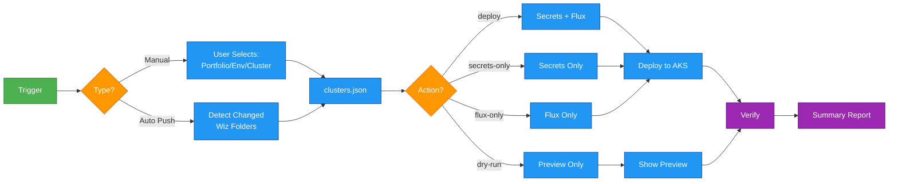
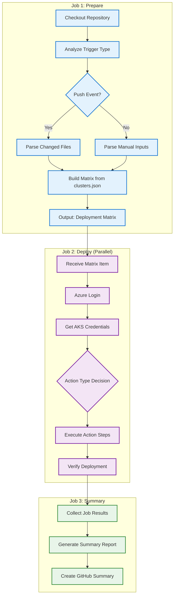
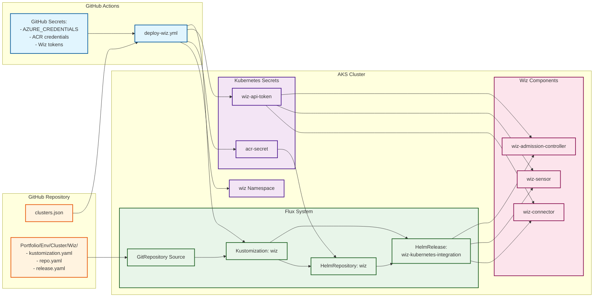

# Wiz Kubernetes Integration Deployment Guide

Automated deployment of Wiz Kubernetes Integration using GitHub Actions and Flux GitOps across multiple portfolios and environments.

---

## Table of Contents

1. [Overview](#overview)
2. [Architecture](#architecture)
3. [Workflow Flowchart](#workflow-flowchart)
4. [Prerequisites](#prerequisites)
5. [Repository Structure](#repository-structure)
6. [Configuration Files](#configuration-files)
7. [GitHub Actions Workflow](#github-actions-workflow)
8. [GitHub Secrets Setup](#github-secrets-setup)
9. [Wiz Kubernetes Files](#wiz-kubernetes-files)
10. [Usage Guide](#usage-guide)
11. [Key Vault Integration (Optional)](#key-vault-integration-optional)
12. [Troubleshooting](#troubleshooting)
13. [Quick Start Checklist](#quick-start-checklist)

---

## Overview

This guide provides a reusable, automated solution for deploying Wiz Kubernetes Integration across multiple AKS clusters using:

- **GitHub Actions** - CI/CD automation
- **Flux** - GitOps continuous delivery
- **Kustomize** - Kubernetes configuration management

### Key Features

| Feature | Description |
|---------|-------------|
| Multi-Portfolio Support | Deploy across different portfolios (Selling Data, etc.) |
| Multi-Environment Support | Handle Production and Non-Production environments |
| Selective Deployment | Deploy to specific clusters or all at once |
| Dry Run Mode | Preview changes before applying |
| Auto-Trigger | Automatic deployment on Git push to Wiz folders |
| Independent Deployment | Wiz deployment doesn't affect other Flux components |

---

## Architecture

### How It Works

```
┌─────────────────────────────────────────────────────────────────────┐
│                         GitHub Repository                           │
│                                                                     │
│  ┌─────────────────┐    ┌─────────────────────────────────────┐    │
│  │ .github/        │    │ Selling Data/                       │    │
│  │   workflows/    │    │   ├── Non Production/               │    │
│  │     deploy-     │    │   │     └── sellingdataaks/         │    │
│  │     wiz.yml     │    │   │           └── Wiz/              │    │
│  └────────┬────────┘    │   └── Production/                   │    │
│           │             │         └── sellingdataprodaks/     │    │
│           │             │               └── Wiz/              │    │
│           │             └─────────────────────────────────────┘    │
└───────────┼─────────────────────────────────────────────────────────┘
            │
            │ Triggers on:
            │ - Manual dispatch
            │ - Push to **/Wiz/**
            ▼
┌─────────────────────────────────────────────────────────────────────┐
│                      GitHub Actions Workflow                        │
│                                                                     │
│  1. Read clusters.json to determine targets                         │
│  2. Azure Login                                                     │
│  3. For each target cluster:                                        │
│     ├── Get AKS credentials                                         │
│     ├── Create namespace & secrets                                  │
│     └── Setup/Update Flux configuration                             │
└─────────────────────────────────────────────────────────────────────┘
            │
            │ Creates Flux Kustomization
            ▼
┌─────────────────────────────────────────────────────────────────────┐
│                         AKS Cluster                                 │
│                                                                     │
│  ┌─────────────────────────────────────────────────────────────┐   │
│  │                    Flux Controller                           │   │
│  │                                                              │   │
│  │  ┌──────────────┐ ┌──────────────┐ ┌──────────────┐        │   │
│  │  │ Kustomization│ │ Kustomization│ │ Kustomization│        │   │
│  │  │   velero     │ │  dynatrace   │ │     wiz      │ ← NEW  │   │
│  │  └──────────────┘ └──────────────┘ └──────────────┘        │   │
│  │         │                │                │                 │   │
│  │         ▼                ▼                ▼                 │   │
│  │  ┌──────────────┐ ┌──────────────┐ ┌──────────────┐        │   │
│  │  │ HelmRelease  │ │ HelmRelease  │ │ HelmRelease  │        │   │
│  │  │   Velero     │ │  Dynatrace   │ │     Wiz      │        │   │
│  │  └──────────────┘ └──────────────┘ └──────────────┘        │   │
│  └─────────────────────────────────────────────────────────────┘   │
└─────────────────────────────────────────────────────────────────────┘
```

### Why Wiz Deployment Won't Affect Other Components

Each Flux Kustomization operates independently:

- Separate Git paths
- Separate reconciliation cycles
- Separate namespaces
- No shared dependencies

---

## Workflow Flowchart

### Complete Deployment Flow

```mermaid
flowchart TD
    Start([Deployment Triggered]) --> TriggerCheck{Trigger Type?}

    %% Manual Trigger Path
    TriggerCheck -->|Manual Dispatch| ManualInputs[Collect User Inputs:<br/>- Portfolio<br/>- Environment<br/>- Cluster<br/>- Action]
    ManualInputs --> FilterClusters[Filter clusters.json<br/>based on inputs]

    %% Auto Trigger Path
    TriggerCheck -->|Git Push to **/Wiz/**| DetectChanges[Analyze Changed Files<br/>in Wiz folders]
    DetectChanges --> ExtractPath[Extract Portfolio,<br/>Environment, Cluster<br/>from file paths]
    ExtractPath --> MatchConfig[Match with<br/>clusters.json]

    %% Merge Paths
    FilterClusters --> BuildMatrix[Build Deployment Matrix]
    MatchConfig --> BuildMatrix

    BuildMatrix --> MatrixCheck{Matrix Empty?}
    MatrixCheck -->|Yes| NoTargets[No deployment targets<br/>Workflow ends]
    MatrixCheck -->|No| DisplayTargets[Display Deployment Targets]

    DisplayTargets --> ParallelDeploy{For Each Cluster<br/>in Matrix}

    %% Parallel Deployment Loop
    ParallelDeploy --> ClusterInfo[Display Cluster Info:<br/>- Portfolio<br/>- Environment<br/>- Resource Group]

    ClusterInfo --> AzureLogin[Azure Login with<br/>Service Principal]
    AzureLogin --> SetSubscription[Set Azure Subscription]
    SetSubscription --> GetAKSCreds[Get AKS Credentials<br/>kubectl config]

    GetAKSCreds --> ActionCheck{Action Type?}

    %% Dry Run Path
    ActionCheck -->|dry-run| DryRunPreview[Preview Actions:<br/>- Namespace creation<br/>- Secret creation<br/>- Flux setup]
    DryRunPreview --> ShowCurrentState[Show Current State:<br/>- Namespaces<br/>- Flux configs]
    ShowCurrentState --> VerifyDeploy

    %% Secrets Only Path
    ActionCheck -->|secrets-only| CreateNamespace[Create wiz Namespace]
    CreateNamespace --> CreateACRSecret[Create ACR Secret<br/>docker-registry type]
    CreateACRSecret --> ValidateWizCreds{Wiz Credentials<br/>Found?}
    ValidateWizCreds -->|No| ErrorMissingCreds[Error: Missing Wiz<br/>credentials for prefix]
    ValidateWizCreds -->|Yes| CreateWizSecret[Create wiz-api-token<br/>Secret with clientId<br/>and clientToken]
    CreateWizSecret --> VerifyDeploy

    %% Flux Only Path
    ActionCheck -->|flux-only| CheckFluxExists{Flux Config<br/>Exists?}
    CheckFluxExists -->|Yes| UpdateFlux[Update Existing<br/>Flux Configuration]
    CheckFluxExists -->|No| CreateFlux[Create New Flux<br/>Configuration:<br/>- Source: GitHub repo<br/>- Path: Portfolio/Env/Cluster/Wiz]
    UpdateFlux --> VerifyDeploy
    CreateFlux --> VerifyDeploy

    %% Full Deploy Path
    ActionCheck -->|deploy| FullDeployNS[Create wiz Namespace]
    FullDeployNS --> FullDeployACR[Create ACR Secret]
    FullDeployACR --> ValidateFullWizCreds{Wiz Credentials<br/>Found?}
    ValidateFullWizCreds -->|No| ErrorMissingFullCreds[Error: Missing Wiz<br/>credentials]
    ValidateFullWizCreds -->|Yes| FullDeployWizSecret[Create wiz-api-token<br/>Secret]
    FullDeployWizSecret --> CheckFluxExistsFull{Flux Config<br/>Exists?}
    CheckFluxExistsFull -->|Yes| UpdateFluxFull[Update Flux<br/>Configuration]
    CheckFluxExistsFull -->|No| CreateFluxFull[Create Flux<br/>Configuration]
    UpdateFluxFull --> VerifyDeploy
    CreateFluxFull --> VerifyDeploy

    %% Verification
    VerifyDeploy[Verify Deployment:<br/>- List secrets in wiz namespace<br/>- List Flux configurations<br/>- List Kustomizations]

    VerifyDeploy --> DeployComplete{More Clusters<br/>in Matrix?}
    DeployComplete -->|Yes| ParallelDeploy
    DeployComplete -->|No| GenerateSummary

    %% Summary
    GenerateSummary[Generate Summary Report:<br/>- Trigger info<br/>- Input parameters<br/>- Job results]

    GenerateSummary --> End([Deployment Complete])

    ErrorMissingCreds --> End
    ErrorMissingFullCreds --> End
    NoTargets --> End

    %% Styling
    classDef startEnd fill:#4CAF50,stroke:#2E7D32,color:#fff,stroke-width:3px
    classDef decision fill:#FF9800,stroke:#E65100,color:#fff,stroke-width:2px
    classDef process fill:#2196F3,stroke:#0D47A1,color:#fff,stroke-width:2px
    classDef error fill:#F44336,stroke:#B71C1C,color:#fff,stroke-width:2px
    classDef verify fill:#9C27B0,stroke:#4A148C,color:#fff,stroke-width:2px

    class Start,End startEnd
    class TriggerCheck,MatrixCheck,ActionCheck,ValidateWizCreds,ValidateFullWizCreds,CheckFluxExists,CheckFluxExistsFull,DeployComplete decision
    class ManualInputs,FilterClusters,DetectChanges,ExtractPath,MatchConfig,BuildMatrix,AzureLogin,SetSubscription,GetAKSCreds,CreateNamespace,CreateACRSecret,CreateWizSecret,UpdateFlux,CreateFlux,FullDeployNS,FullDeployACR,FullDeployWizSecret,UpdateFluxFull,CreateFluxFull process
    class ErrorMissingCreds,ErrorMissingFullCreds error
    class VerifyDeploy,GenerateSummary verify
```



### Simplified Decision Flow



### GitHub Actions Job Flow



### Flux Integration Architecture



---

## Prerequisites

### Required Tools & Access

- [ ] GitHub repository with Actions enabled
- [ ] Azure subscription with AKS clusters
- [ ] Azure Service Principal with appropriate permissions
- [ ] Wiz API credentials (Client ID and Token)
- [ ] Azure Container Registry (ACR) access
- [ ] Flux already configured on AKS clusters

### Azure Service Principal Permissions

```bash
# Create Service Principal with required permissions
az ad sp create-for-rbac \
  --name "github-aks-wiz-deploy" \
  --role "Azure Kubernetes Service Contributor" \
  --scopes /subscriptions/<subscription-id> \
  --sdk-auth
```

Required roles:
- `Azure Kubernetes Service Contributor` - For AKS access
- `Azure Kubernetes Service Cluster User Role` - For kubectl access
- `Reader` - For reading resources

---

## Repository Structure

```
gitops/                                    # Repository root
├── .github/
│   └── workflows/
│       └── deploy-wiz.yml                 # GitHub Actions workflow
│
├── config/
│   └── clusters.json                      # Cluster configuration
│
├── Selling Data/                          # Portfolio folder
│   ├── Non Production/                    # Environment folder
│   │   └── sellingdataaks/                # Cluster folder
│   │       ├── Velero/                    # Existing component
│   │       │   ├── kustomization.yaml
│   │       │   ├── release.yaml
│   │       │   └── repo.yaml
│   │       ├── Dynatrace/                 # Existing component
│   │       ├── Nginx/                     # Existing component
│   │       └── Wiz/                       # NEW - Wiz component
│   │           ├── kustomization.yaml
│   │           ├── release.yaml
│   │           └── repo.yaml
│   │
│   └── Production/                        # Environment folder
│       └── sellingdataprodaks/            # Cluster folder
│           └── Wiz/
│               ├── kustomization.yaml
│               ├── release.yaml
│               └── repo.yaml
│
├── Another Portfolio/                     # Another portfolio
│   ├── Non Production/
│   │   └── anotheraks/
│   │       └── Wiz/
│   └── Production/
│       └── anotherprodaks/
│           └── Wiz/
│
└── README.md
```

---

## Configuration Files

### clusters.json

This file defines all clusters and their configurations. The workflow uses this to determine deployment targets.

**File:** `config/clusters.json`

```json
{
  "clusters": [
    {
      "portfolio": "Selling Data",
      "environment": "Non Production",
      "cluster_name": "sellingdataaks",
      "resource_group": "sellingdata-nonprod-rg",
      "subscription_id": "xxxxxxxx-xxxx-xxxx-xxxx-xxxxxxxxxxxx",
      "wiz_secret_prefix": "SELLINGDATA_NONPROD",
      "acr_server": "sellingdataacr.azurecr.io"
    },
    {
      "portfolio": "Selling Data",
      "environment": "Production",
      "cluster_name": "sellingdataprodaks",
      "resource_group": "sellingdata-prod-rg",
      "subscription_id": "xxxxxxxx-xxxx-xxxx-xxxx-xxxxxxxxxxxx",
      "wiz_secret_prefix": "SELLINGDATA_PROD",
      "acr_server": "sellingdataacr.azurecr.io"
    },
    {
      "portfolio": "Another Portfolio",
      "environment": "Non Production",
      "cluster_name": "anotheraks",
      "resource_group": "another-nonprod-rg",
      "subscription_id": "yyyyyyyy-yyyy-yyyy-yyyy-yyyyyyyyyyyy",
      "wiz_secret_prefix": "ANOTHER_NONPROD",
      "acr_server": "anotheracr.azurecr.io"
    },
    {
      "portfolio": "Another Portfolio",
      "environment": "Production",
      "cluster_name": "anotherprodaks",
      "resource_group": "another-prod-rg",
      "subscription_id": "yyyyyyyy-yyyy-yyyy-yyyy-yyyyyyyyyyyy",
      "wiz_secret_prefix": "ANOTHER_PROD",
      "acr_server": "anotheracr.azurecr.io"
    }
  ]
}
```

### Configuration Fields

| Field | Description | Example |
|-------|-------------|---------|
| `portfolio` | Portfolio/Project name | `Selling Data` |
| `environment` | Environment type | `Non Production` or `Production` |
| `cluster_name` | AKS cluster name | `sellingdataaks` |
| `resource_group` | Azure resource group | `sellingdata-nonprod-rg` |
| `subscription_id` | Azure subscription ID | `xxxxxxxx-xxxx-xxxx-xxxx-xxxxxxxxxxxx` |
| `wiz_secret_prefix` | Prefix for GitHub secrets | `SELLINGDATA_NONPROD` |
| `acr_server` | ACR server URL | `sellingdataacr.azurecr.io` |

---

## GitHub Actions Workflow

**File:** `.github/workflows/deploy-wiz.yml`

```yaml
name: Deploy Wiz Integration

on:
  # Manual trigger with dropdown selections
  workflow_dispatch:
    inputs:
      portfolio:
        description: 'Portfolio Name'
        required: true
        type: choice
        options:
          - 'Selling Data'
          - 'Another Portfolio'
          - 'ALL'
      environment:
        description: 'Environment'
        required: true
        type: choice
        options:
          - 'Non Production'
          - 'Production'
          - 'ALL'
      cluster:
        description: 'Cluster (leave empty for all in selected portfolio/env)'
        required: false
        type: string
      action:
        description: 'Action to perform'
        required: true
        type: choice
        options:
          - 'deploy'
          - 'secrets-only'
          - 'flux-only'
          - 'dry-run'

  # Auto-trigger on Wiz folder changes
  push:
    branches: [main]
    paths:
      - '**/Wiz/**'

env:
  WIZ_NAMESPACE: wiz

jobs:
  # ============================================================
  # Job 1: Determine which clusters to deploy
  # ============================================================
  prepare:
    runs-on: ubuntu-latest
    outputs:
      matrix: ${{ steps.set-matrix.outputs.matrix }}
    steps:
      - name: Checkout Repository
        uses: actions/checkout@v4
        with:
          fetch-depth: 2  # Need previous commit for diff

      - name: Set Deployment Matrix
        id: set-matrix
        run: |
          if [[ "${{ github.event_name }}" == "push" ]]; then
            echo "=== Push event detected, analyzing changed files ==="
            
            # Get changed files in Wiz folders
            CHANGED_FILES=$(git diff --name-only HEAD~1 HEAD | grep "/Wiz/" || true)
            
            if [ -z "$CHANGED_FILES" ]; then
              echo "No Wiz changes detected"
              echo "matrix={\"include\":[]}" >> $GITHUB_OUTPUT
              exit 0
            fi
            
            echo "Changed files:"
            echo "$CHANGED_FILES"
            
            # Build matrix from changed paths
            MATRIX_ITEMS="[]"
            while IFS= read -r file; do
              if [ -n "$file" ]; then
                # Extract portfolio, environment, cluster from path
                PORTFOLIO=$(echo "$file" | cut -d'/' -f1)
                ENVIRONMENT=$(echo "$file" | cut -d'/' -f2)
                CLUSTER=$(echo "$file" | cut -d'/' -f3)
                
                # Find matching cluster config
                CLUSTER_CONFIG=$(jq -c --arg p "$PORTFOLIO" --arg e "$ENVIRONMENT" --arg c "$CLUSTER" \
                  '.clusters[] | select(.portfolio == $p and .environment == $e and .cluster_name == $c)' \
                  config/clusters.json)
                
                if [ -n "$CLUSTER_CONFIG" ]; then
                  # Add to matrix if not already present
                  MATRIX_ITEMS=$(echo "$MATRIX_ITEMS" | jq -c --argjson item "$CLUSTER_CONFIG" \
                    'if any(. == $item) then . else . + [$item] end')
                fi
              fi
            done <<< "$CHANGED_FILES"
            
            echo "matrix={\"include\":$MATRIX_ITEMS}" >> $GITHUB_OUTPUT
            
          else
            echo "=== Manual trigger, filtering based on inputs ==="
            
            PORTFOLIO="${{ github.event.inputs.portfolio }}"
            ENVIRONMENT="${{ github.event.inputs.environment }}"
            CLUSTER="${{ github.event.inputs.cluster }}"
            
            echo "Portfolio: $PORTFOLIO"
            echo "Environment: $ENVIRONMENT"
            echo "Cluster: $CLUSTER"
            
            MATRIX_JSON=$(jq -c --arg p "$PORTFOLIO" --arg e "$ENVIRONMENT" --arg c "$CLUSTER" '
              .clusters | map(select(
                ($p == "ALL" or .portfolio == $p) and
                ($e == "ALL" or .environment == $e) and
                ($c == "" or .cluster_name == $c)
              ))
            ' config/clusters.json)
            
            echo "matrix={\"include\":$MATRIX_JSON}" >> $GITHUB_OUTPUT
          fi

      - name: Display Deployment Targets
        run: |
          echo "=== Deployment Targets ==="
          echo '${{ steps.set-matrix.outputs.matrix }}' | jq .

  # ============================================================
  # Job 2: Deploy to each cluster (parallel execution)
  # ============================================================
  deploy:
    needs: prepare
    if: ${{ needs.prepare.outputs.matrix != '{"include":[]}' && needs.prepare.outputs.matrix != '' }}
    runs-on: ubuntu-latest
    strategy:
      matrix: ${{ fromJson(needs.prepare.outputs.matrix) }}
      fail-fast: false
      max-parallel: 3
    
    steps:
      - name: Checkout Repository
        uses: actions/checkout@v4

      - name: Display Deployment Info
        run: |
          echo "============================================"
          echo "📦 Portfolio:      ${{ matrix.portfolio }}"
          echo "🌍 Environment:    ${{ matrix.environment }}"
          echo "☸️  Cluster:        ${{ matrix.cluster_name }}"
          echo "📁 Resource Group: ${{ matrix.resource_group }}"
          echo "🔑 Secret Prefix:  ${{ matrix.wiz_secret_prefix }}"
          echo "============================================"

      - name: Azure Login
        uses: azure/login@v2
        with:
          creds: ${{ secrets.AZURE_CREDENTIALS }}

      - name: Set Azure Subscription
        run: |
          az account set --subscription ${{ matrix.subscription_id }}
          echo "Active subscription: $(az account show --query name -o tsv)"

      - name: Get AKS Credentials
        run: |
          az aks get-credentials \
            --resource-group ${{ matrix.resource_group }} \
            --name ${{ matrix.cluster_name }} \
            --overwrite-existing
          
          echo "Connected to cluster:"
          kubectl cluster-info | head -2

      # --------------------------------------------------------
      # Dry Run Mode
      # --------------------------------------------------------
      - name: Dry Run - Preview Changes
        if: ${{ github.event.inputs.action == 'dry-run' }}
        run: |
          echo "============================================"
          echo "           🔍 DRY RUN MODE                  "
          echo "============================================"
          echo ""
          echo "Would perform the following actions:"
          echo ""
          echo "1. Create namespace: $WIZ_NAMESPACE"
          kubectl create namespace $WIZ_NAMESPACE --dry-run=client -o yaml | head -10
          echo ""
          echo "2. Create ACR secret: acr-secret"
          echo "   - Server: ${{ matrix.acr_server }}"
          echo ""
          echo "3. Create Wiz API token secret: wiz-api-token"
          echo "   - Using secrets with prefix: ${{ matrix.wiz_secret_prefix }}"
          echo ""
          echo "4. Setup Flux Kustomization:"
          echo "   - Name: wiz-integration"
          echo "   - Path: ./${{ matrix.portfolio }}/${{ matrix.environment }}/${{ matrix.cluster_name }}/Wiz"
          echo ""
          echo "Current cluster state:"
          echo "- Namespaces:"
          kubectl get namespaces | grep -E "^(wiz|NAME)" || echo "  wiz namespace does not exist"
          echo ""
          echo "- Existing Flux configurations:"
          az aks flux configuration list \
            --resource-group ${{ matrix.resource_group }} \
            --cluster-name ${{ matrix.cluster_name }} \
            --cluster-type managedClusters \
            --query "[].{Name:name, Status:provisioningState}" -o table 2>/dev/null || echo "  No Flux configurations found"

      # --------------------------------------------------------
      # Create Namespace
      # --------------------------------------------------------
      - name: Create Wiz Namespace
        if: ${{ github.event.inputs.action != 'dry-run' && github.event.inputs.action != 'flux-only' }}
        run: |
          echo "Creating namespace: $WIZ_NAMESPACE"
          kubectl create namespace $WIZ_NAMESPACE --dry-run=client -o yaml | kubectl apply -f -
          kubectl get namespace $WIZ_NAMESPACE

      # --------------------------------------------------------
      # Create ACR Secret
      # --------------------------------------------------------
      - name: Create ACR Secret
        if: ${{ github.event.inputs.action != 'dry-run' && github.event.inputs.action != 'flux-only' }}
        env:
          ACR_SERVER: ${{ matrix.acr_server }}
          ACR_USERNAME: ${{ secrets.ACR_USERNAME }}
          ACR_PASSWORD: ${{ secrets.ACR_PASSWORD }}
        run: |
          echo "Creating ACR secret for: $ACR_SERVER"
          
          kubectl create secret docker-registry acr-secret \
            --namespace $WIZ_NAMESPACE \
            --docker-server=$ACR_SERVER \
            --docker-username=$ACR_USERNAME \
            --docker-password=$ACR_PASSWORD \
            --dry-run=client -o yaml | kubectl apply -f -
          
          echo "ACR secret created successfully"

      # --------------------------------------------------------
      # Create Wiz Token Secret
      # --------------------------------------------------------
      - name: Create Wiz Token Secret
        if: ${{ github.event.inputs.action != 'dry-run' && github.event.inputs.action != 'flux-only' }}
        env:
          WIZ_CLIENT_ID: ${{ secrets[format('{0}_WIZ_CLIENT_ID', matrix.wiz_secret_prefix)] }}
          WIZ_CLIENT_TOKEN: ${{ secrets[format('{0}_WIZ_CLIENT_TOKEN', matrix.wiz_secret_prefix)] }}
        run: |
          echo "Creating Wiz API token secret"
          
          if [ -z "$WIZ_CLIENT_ID" ] || [ -z "$WIZ_CLIENT_TOKEN" ]; then
            echo "::error::Wiz credentials not found for prefix: ${{ matrix.wiz_secret_prefix }}"
            echo "Expected secrets:"
            echo "  - ${{ matrix.wiz_secret_prefix }}_WIZ_CLIENT_ID"
            echo "  - ${{ matrix.wiz_secret_prefix }}_WIZ_CLIENT_TOKEN"
            exit 1
          fi
          
          kubectl create secret generic wiz-api-token \
            --namespace $WIZ_NAMESPACE \
            --from-literal=clientId=$WIZ_CLIENT_ID \
            --from-literal=clientToken=$WIZ_CLIENT_TOKEN \
            --dry-run=client -o yaml | kubectl apply -f -
          
          echo "Wiz token secret created successfully"

      # --------------------------------------------------------
      # Setup Flux
      # --------------------------------------------------------
      - name: Setup Flux for Wiz
        if: ${{ github.event.inputs.action != 'dry-run' && github.event.inputs.action != 'secrets-only' }}
        env:
          FLUX_PATH: "./${{ matrix.portfolio }}/${{ matrix.environment }}/${{ matrix.cluster_name }}/Wiz"
        run: |
          echo "Setting up Flux for path: $FLUX_PATH"
          
          # Check if flux config already exists
          EXISTING=$(az aks flux configuration list \
            --resource-group ${{ matrix.resource_group }} \
            --cluster-name ${{ matrix.cluster_name }} \
            --cluster-type managedClusters \
            --query "[?name=='wiz-integration'].name" -o tsv 2>/dev/null || echo "")
          
          if [ -n "$EXISTING" ]; then
            echo "Flux configuration 'wiz-integration' exists, updating..."
            az aks flux configuration update \
              --resource-group ${{ matrix.resource_group }} \
              --cluster-name ${{ matrix.cluster_name }} \
              --cluster-type managedClusters \
              --name wiz-integration \
              --kustomization name=wiz path="$FLUX_PATH" prune=true
          else
            echo "Creating new Flux configuration 'wiz-integration'..."
            az aks flux create \
              --resource-group ${{ matrix.resource_group }} \
              --cluster-name ${{ matrix.cluster_name }} \
              --name wiz-integration \
              --namespace flux-system \
              --scope cluster \
              --url https://github.com/${{ github.repository }} \
              --branch main \
              --kustomization name=wiz path="$FLUX_PATH" prune=true
          fi
          
          echo "Flux configuration completed"

      # --------------------------------------------------------
      # Verify Deployment
      # --------------------------------------------------------
      - name: Verify Deployment
        if: ${{ github.event.inputs.action != 'dry-run' }}
        run: |
          echo "============================================"
          echo "         ✅ Deployment Verification         "
          echo "============================================"
          echo ""
          echo "Secrets in $WIZ_NAMESPACE namespace:"
          kubectl get secrets -n $WIZ_NAMESPACE
          echo ""
          echo "Flux configurations:"
          az aks flux configuration list \
            --resource-group ${{ matrix.resource_group }} \
            --cluster-name ${{ matrix.cluster_name }} \
            --cluster-type managedClusters \
            --query "[].{Name:name, Status:provisioningState, Scope:scope}" -o table
          echo ""
          echo "Flux Kustomizations:"
          kubectl get kustomizations -n flux-system 2>/dev/null || echo "Unable to list kustomizations"

  # ============================================================
  # Job 3: Summary Report
  # ============================================================
  summary:
    needs: [prepare, deploy]
    if: always()
    runs-on: ubuntu-latest
    steps:
      - name: Generate Summary
        run: |
          echo "## 🚀 Wiz Deployment Summary" >> $GITHUB_STEP_SUMMARY
          echo "" >> $GITHUB_STEP_SUMMARY
          echo "**Trigger:** ${{ github.event_name }}" >> $GITHUB_STEP_SUMMARY
          echo "**Branch:** ${{ github.ref_name }}" >> $GITHUB_STEP_SUMMARY
          echo "**Commit:** ${{ github.sha }}" >> $GITHUB_STEP_SUMMARY
          echo "" >> $GITHUB_STEP_SUMMARY
          
          if [[ "${{ github.event_name }}" == "workflow_dispatch" ]]; then
            echo "### Input Parameters" >> $GITHUB_STEP_SUMMARY
            echo "| Parameter | Value |" >> $GITHUB_STEP_SUMMARY
            echo "|-----------|-------|" >> $GITHUB_STEP_SUMMARY
            echo "| Portfolio | ${{ github.event.inputs.portfolio }} |" >> $GITHUB_STEP_SUMMARY
            echo "| Environment | ${{ github.event.inputs.environment }} |" >> $GITHUB_STEP_SUMMARY
            echo "| Cluster | ${{ github.event.inputs.cluster || 'All matching' }} |" >> $GITHUB_STEP_SUMMARY
            echo "| Action | ${{ github.event.inputs.action }} |" >> $GITHUB_STEP_SUMMARY
            echo "" >> $GITHUB_STEP_SUMMARY
          fi
          
          echo "### Job Results" >> $GITHUB_STEP_SUMMARY
          echo "| Job | Status |" >> $GITHUB_STEP_SUMMARY
          echo "|-----|--------|" >> $GITHUB_STEP_SUMMARY
          echo "| Prepare | ${{ needs.prepare.result }} |" >> $GITHUB_STEP_SUMMARY
          echo "| Deploy | ${{ needs.deploy.result }} |" >> $GITHUB_STEP_SUMMARY
```

---

## GitHub Secrets Setup

### Required Secrets

Navigate to **Repository → Settings → Secrets and variables → Actions → New repository secret**

#### Global Secrets (Shared Across All Clusters)

| Secret Name | Description | Example Value |
|-------------|-------------|---------------|
| `AZURE_CREDENTIALS` | Service Principal JSON | See below |
| `ACR_USERNAME` | Azure Container Registry username | `sellingdataacr` |
| `ACR_PASSWORD` | Azure Container Registry password/token | `xxxxxxxx` |

#### Per-Environment Wiz Secrets

Naming convention: `{wiz_secret_prefix}_WIZ_CLIENT_ID` and `{wiz_secret_prefix}_WIZ_CLIENT_TOKEN`

| Secret Name | Description |
|-------------|-------------|
| `SELLINGDATA_NONPROD_WIZ_CLIENT_ID` | Wiz Client ID for Selling Data Non-Prod |
| `SELLINGDATA_NONPROD_WIZ_CLIENT_TOKEN` | Wiz Token for Selling Data Non-Prod |
| `SELLINGDATA_PROD_WIZ_CLIENT_ID` | Wiz Client ID for Selling Data Prod |
| `SELLINGDATA_PROD_WIZ_CLIENT_TOKEN` | Wiz Token for Selling Data Prod |
| `ANOTHER_NONPROD_WIZ_CLIENT_ID` | Wiz Client ID for Another Portfolio Non-Prod |
| `ANOTHER_NONPROD_WIZ_CLIENT_TOKEN` | Wiz Token for Another Portfolio Non-Prod |
| `ANOTHER_PROD_WIZ_CLIENT_ID` | Wiz Client ID for Another Portfolio Prod |
| `ANOTHER_PROD_WIZ_CLIENT_TOKEN` | Wiz Token for Another Portfolio Prod |

### AZURE_CREDENTIALS Format

```json
{
  "clientId": "xxxxxxxx-xxxx-xxxx-xxxx-xxxxxxxxxxxx",
  "clientSecret": "your-client-secret",
  "subscriptionId": "xxxxxxxx-xxxx-xxxx-xxxx-xxxxxxxxxxxx",
  "tenantId": "xxxxxxxx-xxxx-xxxx-xxxx-xxxxxxxxxxxx"
}
```

### Generate Service Principal

```bash
az ad sp create-for-rbac \
  --name "github-aks-wiz-deploy" \
  --role "Contributor" \
  --scopes /subscriptions/<subscription-id> \
  --sdk-auth
```

Copy the entire JSON output to the `AZURE_CREDENTIALS` secret.

---

## Wiz Kubernetes Files

Create these files in each cluster's Wiz folder.

### kustomization.yaml

**File:** `{Portfolio}/{Environment}/{Cluster}/Wiz/kustomization.yaml`

```yaml
apiVersion: kustomize.config.k8s.io/v1beta1
kind: Kustomization

namespace: wiz

resources:
  - repo.yaml
  - release.yaml
```

### repo.yaml

**File:** `{Portfolio}/{Environment}/{Cluster}/Wiz/repo.yaml`

```yaml
apiVersion: source.toolkit.fluxcd.io/v1beta2
kind: HelmRepository
metadata:
  name: wiz
  namespace: wiz
spec:
  interval: 1h
  url: oci://your-acr.azurecr.io/helm
  type: oci
  secretRef:
    name: acr-secret
```

### release.yaml

**File:** `{Portfolio}/{Environment}/{Cluster}/Wiz/release.yaml`

```yaml
apiVersion: helm.toolkit.fluxcd.io/v2beta1
kind: HelmRelease
metadata:
  name: wiz-kubernetes-integration
  namespace: wiz
spec:
  interval: 1h
  chart:
    spec:
      chart: wiz-kubernetes-integration
      version: "1.x.x"  # Specify your version
      sourceRef:
        kind: HelmRepository
        name: wiz
        namespace: wiz
  values:
    global:
      wizApiToken:
        secret:
          name: wiz-api-token
          clientIdKey: clientId
          clientTokenKey: clientToken
    
    wiz-kubernetes-connector:
      enabled: true
      autoCreateConnector:
        enabled: true
        connectorName: "sellingdataaks-connector"  # Update per cluster
        clusterFlavor: "AKS"
    
    wiz-admission-controller:
      enabled: true
    
    wiz-sensor:
      enabled: true
      imagePullSecrets:
        - name: acr-secret
```

---

## Usage Guide

### Manual Deployment

1. Go to **Actions** tab in GitHub
2. Select **Deploy Wiz Integration** workflow
3. Click **Run workflow**
4. Select parameters:
   - **Portfolio**: Choose specific or `ALL`
   - **Environment**: Choose specific or `ALL`
   - **Cluster**: Leave empty for all matching, or specify cluster name
   - **Action**: Choose deployment action

### Action Types

| Action | Description |
|--------|-------------|
| `deploy` | Full deployment (secrets + Flux) |
| `secrets-only` | Only create/update Kubernetes secrets |
| `flux-only` | Only setup/update Flux configuration |
| `dry-run` | Preview changes without applying |

### Deployment Examples

#### Deploy to Single Cluster
```
Portfolio: Selling Data
Environment: Non Production
Cluster: sellingdataaks
Action: deploy
```

#### Deploy to All Non-Production Clusters
```
Portfolio: ALL
Environment: Non Production
Cluster: (empty)
Action: deploy
```

#### Dry Run for Production
```
Portfolio: Selling Data
Environment: Production
Cluster: (empty)
Action: dry-run
```

### Automatic Deployment

Push changes to any `**/Wiz/**` folder:

```bash
git add "Selling Data/Non Production/sellingdataaks/Wiz/release.yaml"
git commit -m "Update Wiz version"
git push origin main
```

The workflow automatically detects which cluster was affected and deploys only to that cluster.

---

## Key Vault Integration (Optional)

For enhanced security, retrieve secrets from Azure Key Vault instead of GitHub Secrets.

### Modified Workflow Step

Replace the secret creation steps with:

```yaml
      - name: Get Secrets from Key Vault
        run: |
          # Define Key Vault name (adjust naming convention as needed)
          KV_NAME="${{ matrix.cluster_name }}-kv"
          
          echo "Retrieving secrets from Key Vault: $KV_NAME"
          
          # Get ACR credentials
          ACR_USERNAME=$(az keyvault secret show --vault-name $KV_NAME --name acr-username --query value -o tsv)
          ACR_PASSWORD=$(az keyvault secret show --vault-name $KV_NAME --name acr-password --query value -o tsv)
          
          # Get Wiz credentials
          WIZ_CLIENT_ID=$(az keyvault secret show --vault-name $KV_NAME --name wiz-client-id --query value -o tsv)
          WIZ_CLIENT_TOKEN=$(az keyvault secret show --vault-name $KV_NAME --name wiz-client-token --query value -o tsv)
          
          # Create ACR secret
          kubectl create secret docker-registry acr-secret \
            --namespace $WIZ_NAMESPACE \
            --docker-server=${{ matrix.acr_server }} \
            --docker-username=$ACR_USERNAME \
            --docker-password=$ACR_PASSWORD \
            --dry-run=client -o yaml | kubectl apply -f -
          
          # Create Wiz token secret
          kubectl create secret generic wiz-api-token \
            --namespace $WIZ_NAMESPACE \
            --from-literal=clientId=$WIZ_CLIENT_ID \
            --from-literal=clientToken=$WIZ_CLIENT_TOKEN \
            --dry-run=client -o yaml | kubectl apply -f -
```

### Required Key Vault Secrets

| Secret Name | Description |
|-------------|-------------|
| `acr-username` | ACR username |
| `acr-password` | ACR password |
| `wiz-client-id` | Wiz API Client ID |
| `wiz-client-token` | Wiz API Token |

### Service Principal Permissions for Key Vault

```bash
# Grant Key Vault access to Service Principal
az keyvault set-policy \
  --name <keyvault-name> \
  --spn <service-principal-client-id> \
  --secret-permissions get list
```

---

## Troubleshooting

### Common Issues

#### 1. Workflow Not Triggering on Push

**Cause:** Path filter not matching

**Solution:** Ensure folder names match exactly (case-sensitive)

```yaml
paths:
  - '**/Wiz/**'  # Matches any Wiz folder
```

#### 2. Azure Login Failed

**Cause:** Invalid or expired credentials

**Solution:**
```bash
# Regenerate credentials
az ad sp create-for-rbac --name "github-aks-wiz-deploy" --sdk-auth

# Update AZURE_CREDENTIALS secret in GitHub
```

#### 3. Wiz Secrets Not Found

**Error:** `Wiz credentials not found for prefix: SELLINGDATA_NONPROD`

**Solution:** Ensure secrets exist with exact naming:
- `SELLINGDATA_NONPROD_WIZ_CLIENT_ID`
- `SELLINGDATA_NONPROD_WIZ_CLIENT_TOKEN`

#### 4. Flux Configuration Failed

**Error:** `Flux configuration already exists`

**Solution:** The workflow handles this automatically by updating existing configurations. If issues persist:

```bash
# Manually delete and recreate
az aks flux configuration delete \
  --resource-group <rg> \
  --cluster-name <cluster> \
  --cluster-type managedClusters \
  --name wiz-integration \
  --yes
```

#### 5. HelmRelease Not Reconciling

**Check Flux status:**

```bash
kubectl get helmreleases -n wiz
kubectl describe helmrelease wiz-kubernetes-integration -n wiz
flux logs --kind=HelmRelease --name=wiz-kubernetes-integration -n wiz
```

### Debug Commands

```bash
# Check Flux configurations
az aks flux configuration list \
  --resource-group <rg> \
  --cluster-name <cluster> \
  --cluster-type managedClusters

# Check Flux kustomizations
kubectl get kustomizations -n flux-system

# Check HelmReleases
kubectl get helmreleases -A

# Check Wiz pods
kubectl get pods -n wiz

# Check secrets
kubectl get secrets -n wiz
```

---

## Quick Start Checklist

### Initial Setup

- [ ] Fork/clone repository
- [ ] Create `.github/workflows/deploy-wiz.yml`
- [ ] Create `config/clusters.json` with your cluster details
- [ ] Add GitHub Secrets:
  - [ ] `AZURE_CREDENTIALS`
  - [ ] `ACR_USERNAME`
  - [ ] `ACR_PASSWORD`
  - [ ] Per-environment Wiz secrets

### Per-Cluster Setup

- [ ] Create folder structure: `{Portfolio}/{Environment}/{Cluster}/Wiz/`
- [ ] Add `kustomization.yaml`
- [ ] Add `repo.yaml`
- [ ] Add `release.yaml`
- [ ] Update `release.yaml` with cluster-specific values

### Deployment

- [ ] Run workflow with `dry-run` action first
- [ ] Verify dry-run output
- [ ] Run workflow with `deploy` action
- [ ] Verify deployment success
- [ ] Check Wiz pods are running

### Validation Commands

```bash
# Verify secrets created
kubectl get secrets -n wiz

# Verify Flux configuration
az aks flux configuration show \
  --resource-group <rg> \
  --cluster-name <cluster> \
  --cluster-type managedClusters \
  --name wiz-integration

# Verify HelmRelease
kubectl get helmrelease -n wiz

# Verify Wiz pods
kubectl get pods -n wiz
```

---

## Support

For issues or questions:
1. Check [Troubleshooting](#troubleshooting) section
2. Review workflow logs in GitHub Actions
3. Check Flux logs: `flux logs -n flux-system`

---

**Document Version:** 1.0  
**Last Updated:** <!-- Update this date -->  
**Maintainer:** <!-- Your team/name -->
